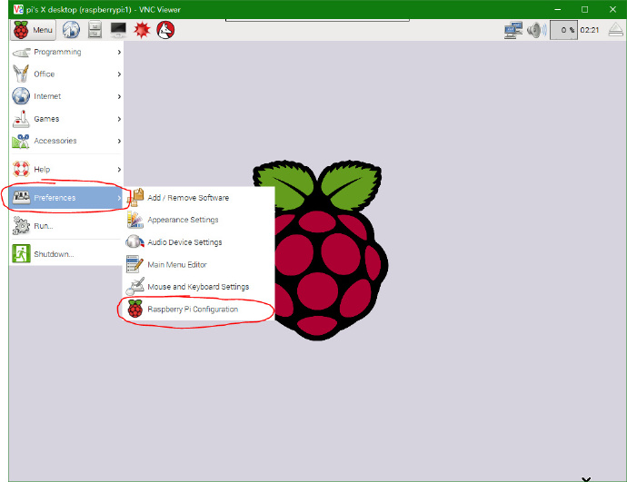
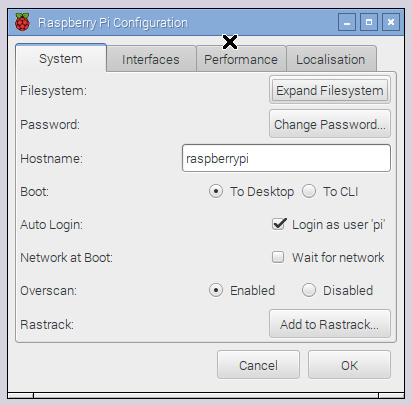
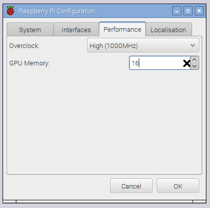

# 树莓派笔记

> 本文部分节选自：[我的世界中文论坛-在树莓派下Minecraft服务器搭建教程](https://www.mcbbs.net/thread-579651-1-1.html)、[用树莓派构建一台服务器，永久运行网站](https://www.jianshu.com/p/7fbf455f3d41)

> 相关网站:[树莓派实验室](http://shumeipai.nxez.com/)


## 安装Raspbian操作系统

从树莓派官网处[下载官方镜像](https://www.raspberrypi.org/downloads/raspbian/)。系统需要写进SD卡，需要先用到[SDFomatter](https://www.sdcard.org/chs/downloads/formatter/index.html)格式化SD卡，然后使用[Win32 Disk Imager](https://sourceforge.net/projects/win32diskimager/)对SD卡进行写盘。等待写盘完成后，需要在电脑上找到一个刚刚烧录好的磁盘分区，名字叫`boot`，在里面创建一个文件名为`SSH`的文件（**无后缀名**），这时就可以将SD卡插回树莓派了。

为树莓派接上MicroUSB电源，如果正常的话红灯将会是常亮的，绿灯将会是闪烁的，Raspbian操作系统就成功地搭载到你的树莓派了！（如果红灯会闪烁的话那么你的电源就是不合格的了）


## 连接到树莓派

### 通过路由+网线连接

使用网线将树莓派喝路由器连接起来，其他连接了路由的设备进入路由器的管理界面，查看树莓派的ip地址，然后就可以使用PuTTY或者MobaXterm通过ssh连接树莓派，默认用户名是`pi`，密码是`raspberry`。


### 通过VNCviewer连接树莓派

在使用ssh的方式连接到树莓派之后,安装VNC服务端：

```sh
sudo apt-get install tightvncserver
```

安装完成后，需要启动VNC并设置VNC连接的端口

```sh
vncserver :1      # 这里冒号后面的数字可以修改，为你通过VNC来连接的端口号
```

然后设置密码，然后就设置完成VNC的服务器端了。

> 如果你下次开机还想通过VNC来连接的话，那么就在`/etc/init.d`这一个文件中把`vncserver:1`这条指令添加进去

这时在windows端打开[VNCviewer](https://www.realvnc.com/en/connect/download/viewer/)，输入ip和端口后即可连接到树莓派的图形化界面。

这时推荐做以下设置：



  打开左上角的`Menu`一栏，选择其中的`Preferences`一栏，再选择`Raspberry Pi Configuration`一栏，出现系统设置界面。



- 点击`Expand Filesystem`，扩容SD卡至卡原本的大小
- 点击`Change Password`修改登录密码
- 更改菜单至`Performance`，将`Overclock`（超频）和`GPU Memory`（显存分配）设置改为下图：



> 关于显存分配，这里有几个可选值：16/32/64/128/256
>
> 如果你将你的树莓派用作文件服务器或Web服务器，不需要使用视频输出，你可以减少分配给GPU的内存数量（最少为16MB）
> 如果你用它来浏览网页，看视频甚至运行3D游戏，那么你应该为GPU分配较大的内存，从而提高GPU性能，使其更好地渲染3D游戏画面
> 如果你需要接入摄像头，则**至少**要为要为GPU分配128MB显存

设置完成后重启生效。


### 使用Advanced IP Scanner获取树莓派ip

前往[Advanced IP Scanner](https://www.advanced-ip-scanner.com/cn/)下载并安装，安装完成后打开软件，使用软件扫描所有局域网内的设备，这个软件的优点在于：能扫描出网络设备的生产商。找到生产商是“Raspberry Pi Foundation”的机器就是树莓派。


## 安装网站服务

### 安装nginx

如果镜像里默认安装了apache，则可能需要先卸载

```sh
sudo apt-get remove --purge apache* -y
sudo apt-get autoremove --purge -y
```


```sh
# 安装
sudo apt-get install nginx
# 给网页文件夹添加权限
sudo chmod -R 777 /var/www/html
# 启动
sudo /etc/init.d/nginx start
# 重启
sudo /etc/init.d/nginx restart
# 停止
sudo /etc/init.d/nginx stop
```


### 安装MySql

```sh
sudo apt-get install mysql-server mysql-client
```

安装过程中会弹出界面让你输入root的密码，输入两次相同的就可以了。

等待安装完成后，即可进入MySql测试是否正常运行

```sh
mysql -u root -p   # 使用账号'root'登入MySQL

\q   # 退出
```

至此，MySql已经安装完成了。

如果你还想让你的数据库解除本地访问的限制，你还需要这样做：

```sh
sudo nano /etc/mysql/my.cnf
```

  使用Ctrl+W组合键来打开搜索栏，输入'bind-address'来定位到对应的一行，在该行前加上'#'来将整行代码注释掉，Ctrl+O保存，Ctrl+X退出。


### 安装PHP7

```sh
sudo apt-get install software-properties-common
sudo add-apt-repository ppa:ondrej/php # 安装php7的ppa源
sudo apt-get update
sudo apt-get install php7.0 php7.0-fpm php7.0-mysql php7.0-common
```

最后一行安装了PHP7.0主体，与Nginx对接的php7.0-fpm插件，与mysql对接的php7.0-mysql插件，常用函数工具php7.0-common插件。


### 重启服务

```sh
sudo /etc/init.d/nginx restart
sudo /etc/init.d/php7-fpm restart
service mysql restart
```


## 其他优化设置

### 开机自启ssh

方法一：

```sh
sudo raspi-config
```

进入选择找到`interfacing option`选择，然后找到ssh，按回车使能enable就可以了

方法二：

在终端命令行中启动SSH服务后，如果系统重启或关机后启动，SSH服务默认是关闭的，依然需要手动启动，为了方便可以设置SSH服务开机自动启动，打开`/etc/rc.local`文件，在语句exit 0之前加入：
 `/etc/init.d/ssh start`


### 修改源

#### 修改sources.list文件

```sh
sudo nano /etc/apt/sources.list 
# 注释其他内容，选择一项添加:
# 阿里云 要装MYSql必须只能用下面的源
deb http://mirrors.aliyun.com/raspbian/raspbian/ wheezy main non-free contrib
deb-src http://mirrors.aliyun.com/raspbian/raspbian/ wheezy main non-free contrib

# 清华
deb http://mirrors.tuna.tsinghua.edu.cn/raspbian/raspbian/ wheezy main contrib non-free rpi 
deb-src http://mirrors.tuna.tsinghua.edu.cn/raspbian/raspbian/ wheezy main contrib non-free rpi 

# 东软
deb http://mirrors.neusoft.edu.cn/raspbian/raspbian/ wheezy main contrib non-free rpi 
deb-src http://mirrors.neusoft.edu.cn/raspbian/raspbian/ wheezy main contrib non-free rpi 

# 中科大
deb http://mirrors.ustc.edu.cn/raspbian/raspbian/ wheezy main contrib non-free rpi 
deb-src http://mirrors.ustc.edu.cn/raspbian/raspbian/ wheezy main contrib non-free rpi


# 最后更新软件
sudo apt-get update && apt-get upgrade -y       #更新系统软件 并 比较索引清单更新依赖关系
```


### 升级系统

```sh
sudo apt-get update
```


### 安装中文字体

```sh
sudo apt-get install ttf-wqy-zenhei     # 安装文泉驿的正黑体
```

安装完成后，可在设置面板设置为中文界面了


